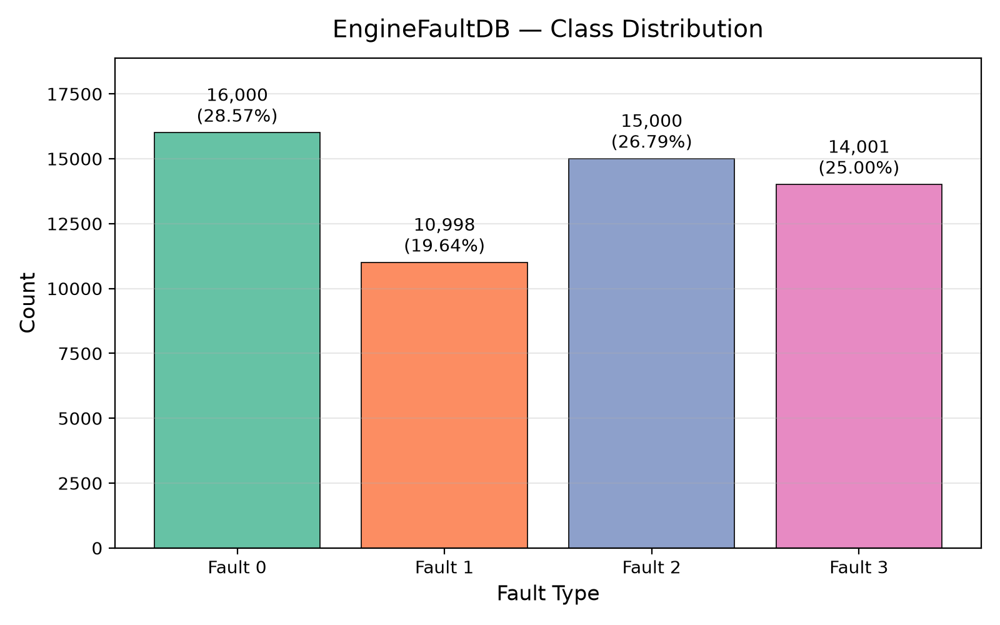
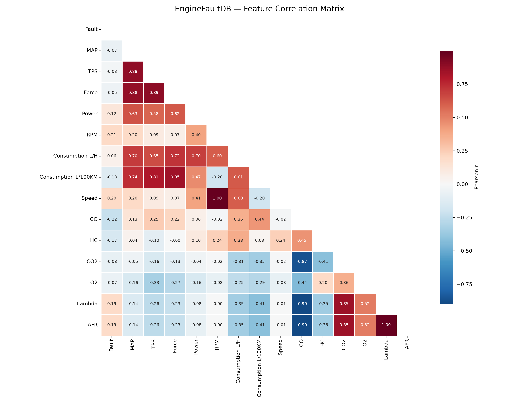

# EngineFaultDB — Dataset Audit Report

**Generated:** Measured directly from `EngineFaultDB_Final.csv`

---

## 1. Repository & File Overview

| Item | Value |
| --- | --- |
| Repository | [Leo-Thomas/EngineFaultDB](https://github.com/Leo-Thomas/EngineFaultDB) |
| License | GNU General Public License v3.0 (GPLv3) |
| Dataset file | `EngineFaultDB_Final.csv` |
| File size | 5.09 MB (5,334,236 bytes) |
| Other files | `README.md`, `LICENSE` |
| Repository structure | Flat (3 files, no subdirectories) |

## 2. Dataset Shape

| Metric | Value |
| --- | --- |
| Rows | 55,999 |
| Columns | 15 |
| Total cells | 839,985 |

## 3. Column Names & Data Types

| # | Column | Dtype | Non-Null Count | Unique Values |
| --- | --- | --- | --- | --- |
| 1 | `Fault` | int64 | 55,999 | 4 |
| 2 | `MAP` | float64 | 55,999 | 259 |
| 3 | `TPS` | float64 | 55,999 | 159 |
| 4 | `Force` | float64 | 55,999 | 40,476 |
| 5 | `Power` | float64 | 55,999 | 10,119 |
| 6 | `RPM` | float64 | 55,999 | 54,819 |
| 7 | `Consumption L/H` | float64 | 55,999 | 6,808 |
| 8 | `Consumption L/100KM` | float64 | 55,999 | 9,208 |
| 9 | `Speed` | float64 | 55,999 | 30,113 |
| 10 | `CO` | float64 | 55,999 | 5,133 |
| 11 | `HC` | float64 | 55,999 | 41,136 |
| 12 | `CO2` | float64 | 55,999 | 5,242 |
| 13 | `O2` | float64 | 55,999 | 889 |
| 14 | `Lambda` | float64 | 55,999 | 416 |
| 15 | `AFR` | float64 | 55,999 | 5,054 |

## 4. Missing Values

**Total missing cells:** 0

No missing values in any column.

## 5. Duplicate Rows

| Metric | Value |
| --- | --- |
| Exact duplicate rows | 1 |
| Duplicate % | 0.00% |

## 6. Class Distribution (Target: `Fault`)

| Fault Type | Count | Percentage |
| --- | --- | --- |
| 0 | 16,000 | 28.57% |
| 1 | 10,998 | 19.64% |
| 2 | 15,000 | 26.79% |
| 3 | 14,001 | 25.00% |
| **Total** | **55,999** | **100%** |

> Class imbalance ratio (max / min): **1.45**



## 7. Descriptive Statistics

| Feature | Count | Mean | Std | Min | 25% | Median | 75% | Max | Range | CV |
| --- | --- | --- | --- | --- | --- | --- | --- | --- | --- | --- |
| Fault | 55999.0000 | 1.4822 | 1.1494 | 0.0000 | 0.0000 | 2.0000 | 3.0000 | 3.0000 | 3.0000 | 0.7755 |
| MAP | 55999.0000 | 1.8325 | 0.8378 | 0.4530 | 1.2170 | 1.5430 | 1.9400 | 4.5470 | 4.0940 | 0.4572 |
| TPS | 55999.0000 | 1.3953 | 0.9070 | 0.3820 | 0.9010 | 1.0130 | 1.2580 | 4.0480 | 3.6660 | 0.6500 |
| Force | 55999.0000 | 286.6917 | 378.7749 | 2.5800 | 76.8485 | 92.5000 | 257.9895 | 1537.1180 | 1534.5380 | 1.3212 |
| Power | 55999.0000 | 5.6571 | 7.6841 | 0.4650 | 0.9940 | 2.3980 | 4.6960 | 33.9460 | 33.4810 | 1.3583 |
| RPM | 55999.0000 | 2398.0538 | 932.0087 | 1066.4520 | 1830.2005 | 2105.5880 | 2761.3735 | 5013.4020 | 3946.9500 | 0.3887 |
| Consumption L/H | 55999.0000 | 4.4976 | 2.2215 | 1.9170 | 2.9810 | 3.8240 | 5.1445 | 14.8100 | 12.8930 | 0.4939 |
| Consumption L/100KM | 55999.0000 | 8.9398 | 3.1541 | 5.1870 | 6.5730 | 8.0680 | 9.9240 | 20.0430 | 14.8560 | 0.3528 |
| Speed | 55999.0000 | 51.6887 | 20.1403 | 22.7570 | 39.4120 | 45.3930 | 59.5080 | 107.5390 | 84.7820 | 0.3896 |
| CO | 55999.0000 | 1.9324 | 1.9888 | 0.4210 | 0.6410 | 1.1290 | 2.4550 | 10.1320 | 9.7110 | 1.0292 |
| HC | 55999.0000 | 188.4461 | 111.0470 | 1.7870 | 158.8030 | 178.2650 | 203.6780 | 975.6570 | 973.8700 | 0.5893 |
| CO2 | 55999.0000 | 13.0352 | 1.0466 | 8.6490 | 12.8420 | 13.2420 | 13.6390 | 15.1290 | 6.4800 | 0.0803 |
| O2 | 55999.0000 | 0.5859 | 0.2237 | 0.2030 | 0.4150 | 0.5330 | 0.7890 | 1.1510 | 0.9480 | 0.3818 |
| Lambda | 55999.0000 | 0.9639 | 0.0660 | 0.6950 | 0.9370 | 0.9770 | 1.0080 | 1.1490 | 0.4540 | 0.0684 |
| AFR | 55999.0000 | 14.1694 | 0.9698 | 10.2100 | 13.7800 | 14.3650 | 14.8230 | 16.8930 | 6.6830 | 0.0684 |

## 8. Feature Ranges

| Feature | Min | Max | Range |
| --- | --- | --- | --- |
| `Fault` | 0.0000 | 3.0000 | 3.0000 |
| `MAP` | 0.4530 | 4.5470 | 4.0940 |
| `TPS` | 0.3820 | 4.0480 | 3.6660 |
| `Force` | 2.5800 | 1537.1180 | 1534.5380 |
| `Power` | 0.4650 | 33.9460 | 33.4810 |
| `RPM` | 1066.4520 | 5013.4020 | 3946.9500 |
| `Consumption L/H` | 1.9170 | 14.8100 | 12.8930 |
| `Consumption L/100KM` | 5.1870 | 20.0430 | 14.8560 |
| `Speed` | 22.7570 | 107.5390 | 84.7820 |
| `CO` | 0.4210 | 10.1320 | 9.7110 |
| `HC` | 1.7870 | 975.6570 | 973.8700 |
| `CO2` | 8.6490 | 15.1290 | 6.4800 |
| `O2` | 0.2030 | 1.1510 | 0.9480 |
| `Lambda` | 0.6950 | 1.1490 | 0.4540 |
| `AFR` | 10.2100 | 16.8930 | 6.6830 |

## 9. Constant / Near-Constant Columns

No constant columns detected.

## 10. Correlation Matrix



### Highly Correlated Feature Pairs (|r| ≥ 0.90)

| Feature A | Feature B | Pearson r |
| --- | --- | --- |
| `Lambda` | `AFR` | 1.0000 |
| `RPM` | `Speed` | 0.9969 |

## 11. Potential Data-Quality Issues

- Duplicate rows found: 1.
- 2 feature pair(s) with |r| ≥ 0.90 (potential multicollinearity).
- Columns with >25% zero values (possible placeholders): Fault (28.6%)

## 12. Reproducibility

The complete Python script used to generate this report is saved as `audit_analysis.py` alongside the dataset.  Key dependencies:

```
Python 3.13+
pandas, numpy, matplotlib, seaborn
```

Run:

```bash
python audit_analysis.py
```

---
*End of report.*
