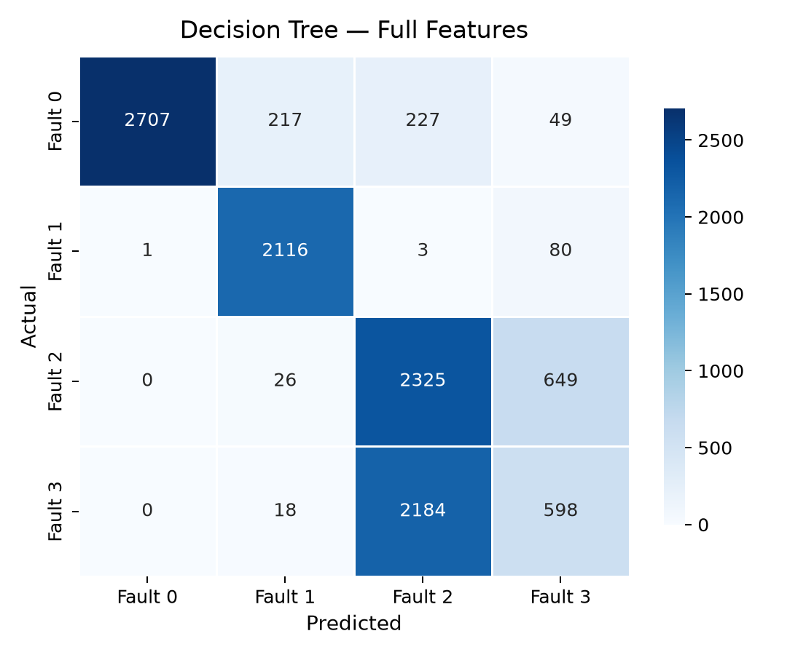
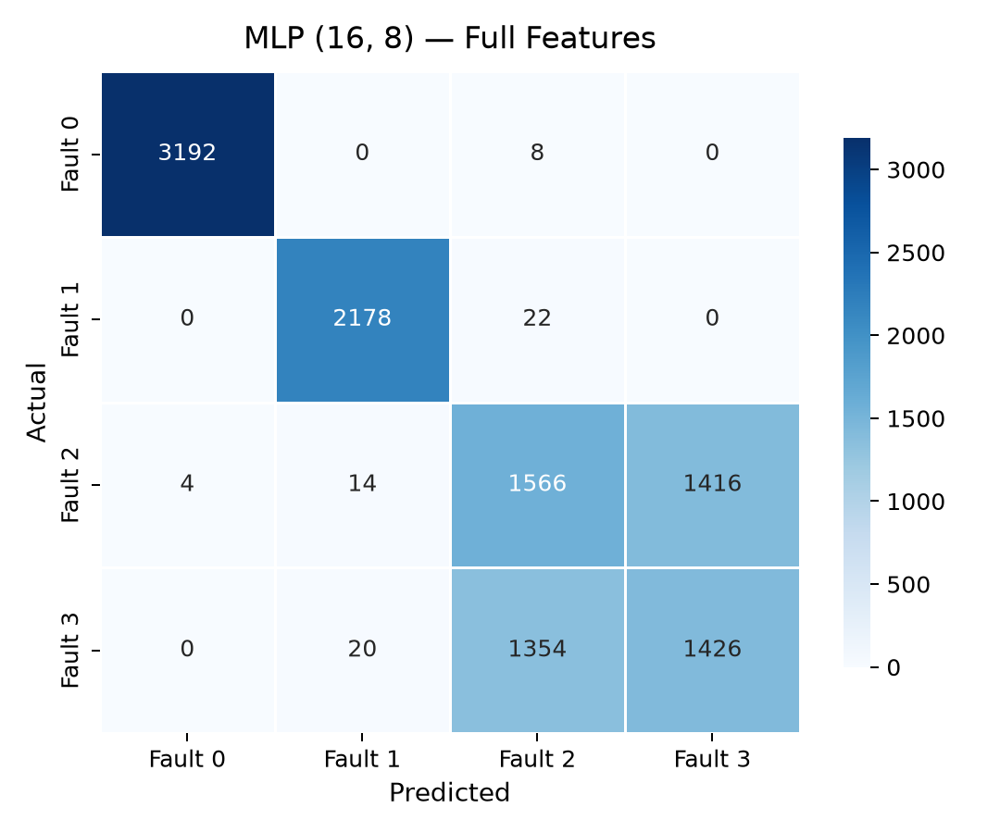
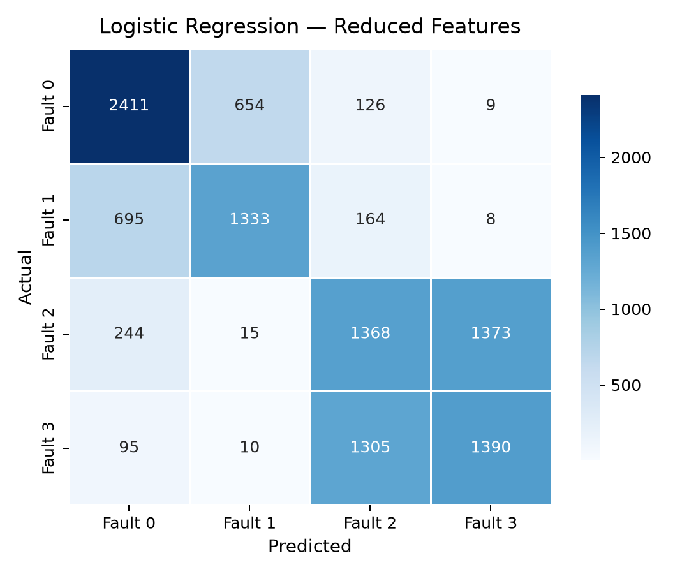
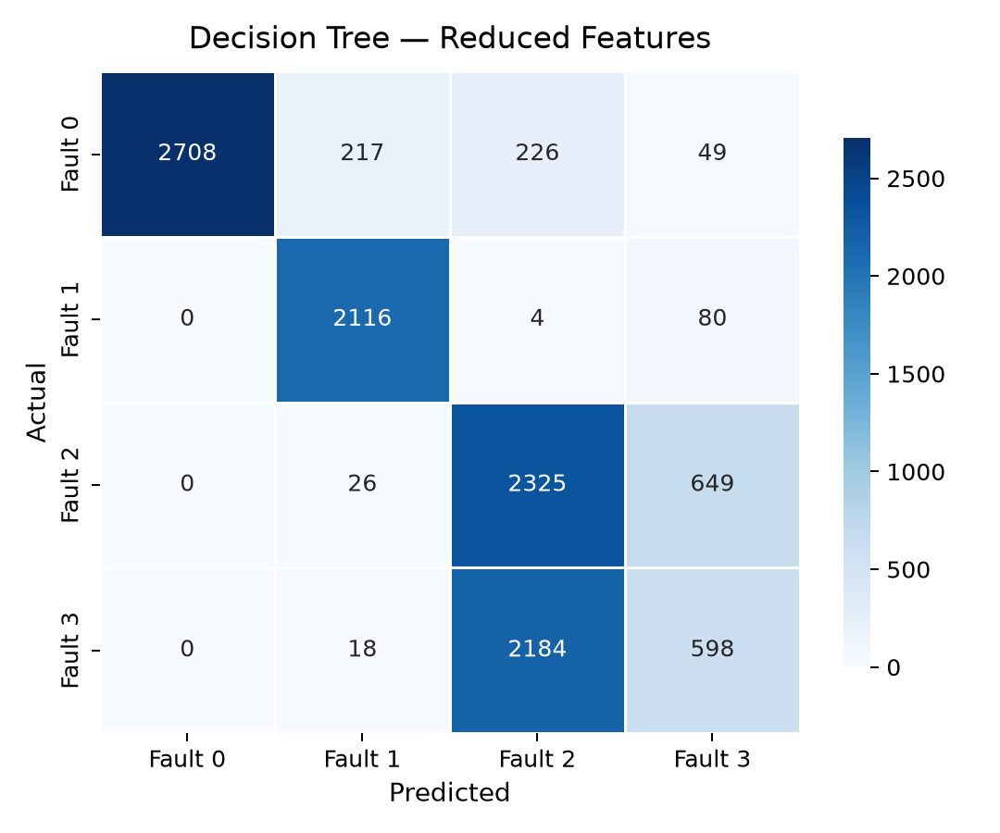
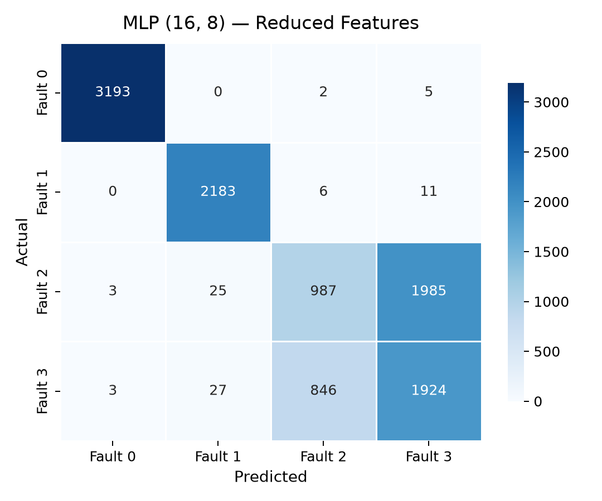

# EngineFaultDB — Phase 2: Baseline Model Benchmark Report

**All values measured from actual model runs on the audited dataset.**

---

## 1. Experiment Setup

| Parameter | Value |
| --- | --- |
| Dataset | `EngineFaultDB_Final.csv` |
| Rows after dedup | 55,998 |
| Train / Val / Test | 40% / 40% / 20% (stratified) |
| Train size | 22,399 |
| Val size | 22,399 |
| Test size | 11,200 |
| Scaler | MinMaxScaler (fit on train only) |
| Random seed | 42 |
| Latency warmup | 1000 iters |
| Latency measurement | 5000 single-sample predictions |
| Timer | `time.perf_counter_ns()` (monotonic, high-resolution) |

## 2. Model Configurations

### Model A — Logistic Regression (Linear Baseline)

```
Solver: lbfgs
Multi-class: multinomial (default in sklearn 1.9)
Max iterations: 2000
```

### Model B — Decision Tree (Lightweight Non-Linear)

```
Max depth: 5 (edge-deployment constraint)
Criterion: gini (default)
```

### Model C — MLP (Neural Network Baseline)

```
Hidden layers: (16, 8)
Activation: relu (default)
Solver: adam (default)
Max iterations: 500
Early stopping: True (patience=20, validation_fraction=0.1)
```

## 3. Feature Sets

### Full (14 features)

`MAP, TPS, Force, Power, RPM, Consumption L/H, Consumption L/100KM, Speed, CO, HC, CO2, O2, Lambda, AFR`

### Reduced (12 features)

Removed `AFR` (r=1.00 with Lambda) and `Speed` (r=0.997 with RPM).

`MAP, TPS, Force, Power, RPM, Consumption L/H, Consumption L/100KM, CO, HC, CO2, O2, Lambda`

## 4. Results Summary

### Experiment 1 — Full Feature Set (14 features)

| Model | Accuracy | Macro P | Macro R | Macro F1 | Params | Size | Mean Lat | P95 Lat | P99 Lat |
| --- | --- | --- | --- | --- | --- | --- | --- | --- | --- |
| Logistic Regression | 0.5800 | 0.5807 | 0.5775 | 0.5786 | 60 | 1.3 KB | 91.2 us | 139.7 us | 269.4 us |
| Decision Tree | 0.6916 | 0.7038 | 0.6991 | 0.6821 | 45 | 5.5 KB | 67.2 us | 82.8 us | 164.2 us |
| MLP (16, 8) | 0.7466 | 0.7540 | 0.7547 | 0.7543 | 412 | 20.1 KB | 142.7 us | 243.1 us | 380.4 us |

### Experiment 2 — Reduced Feature Set (12 features)

| Model | Accuracy | Macro P | Macro R | Macro F1 | Params | Size | Mean Lat | P95 Lat | P99 Lat |
| --- | --- | --- | --- | --- | --- | --- | --- | --- | --- |
| Logistic Regression | 0.5805 | 0.5810 | 0.5779 | 0.5789 | 52 | 1.3 KB | 89.1 us | 123.6 us | 213.1 us |
| Decision Tree | 0.6917 | 0.7039 | 0.6992 | 0.6821 | 45 | 5.5 KB | 70.6 us | 102.5 us | 212.2 us |
| MLP (16, 8) | 0.7399 | 0.7503 | 0.7516 | 0.7406 | 380 | 21.8 KB | 133.1 us | 196.5 us | 337.0 us |

## 5. Per-Class Metrics (Test Set — Full Feature Set)

### Logistic Regression

| Class | Precision | Recall | F1 | Support |
| --- | --- | --- | --- | --- |
| Fault 0 | 0.7001 | 0.7522 | 0.7252 | 3200 |
| Fault 1 | 0.6634 | 0.6064 | 0.6336 | 2200 |
| Fault 2 | 0.4592 | 0.4553 | 0.4572 | 3000 |
| Fault 3 | 0.5004 | 0.4961 | 0.4982 | 2800 |

### Decision Tree

| Class | Precision | Recall | F1 | Support |
| --- | --- | --- | --- | --- |
| Fault 0 | 0.9996 | 0.8459 | 0.9164 | 3200 |
| Fault 1 | 0.8902 | 0.9618 | 0.9246 | 2200 |
| Fault 2 | 0.4906 | 0.7750 | 0.6009 | 3000 |
| Fault 3 | 0.4346 | 0.2136 | 0.2864 | 2800 |

### MLP (16, 8)

| Class | Precision | Recall | F1 | Support |
| --- | --- | --- | --- | --- |
| Fault 0 | 0.9987 | 0.9975 | 0.9981 | 3200 |
| Fault 1 | 0.9846 | 0.9900 | 0.9873 | 2200 |
| Fault 2 | 0.5308 | 0.5220 | 0.5264 | 3000 |
| Fault 3 | 0.5018 | 0.5093 | 0.5055 | 2800 |

## 6. Per-Class Metrics (Test Set — Reduced Feature Set)

### Logistic Regression

| Class | Precision | Recall | F1 | Support |
| --- | --- | --- | --- | --- |
| Fault 0 | 0.6999 | 0.7534 | 0.7257 | 3200 |
| Fault 1 | 0.6625 | 0.6059 | 0.6330 | 2200 |
| Fault 2 | 0.4617 | 0.4560 | 0.4588 | 3000 |
| Fault 3 | 0.5000 | 0.4964 | 0.4982 | 2800 |

### Decision Tree

| Class | Precision | Recall | F1 | Support |
| --- | --- | --- | --- | --- |
| Fault 0 | 1.0000 | 0.8462 | 0.9167 | 3200 |
| Fault 1 | 0.8902 | 0.9618 | 0.9246 | 2200 |
| Fault 2 | 0.4906 | 0.7750 | 0.6009 | 3000 |
| Fault 3 | 0.4346 | 0.2136 | 0.2864 | 2800 |

### MLP (16, 8)

| Class | Precision | Recall | F1 | Support |
| --- | --- | --- | --- | --- |
| Fault 0 | 0.9981 | 0.9978 | 0.9980 | 3200 |
| Fault 1 | 0.9767 | 0.9923 | 0.9844 | 2200 |
| Fault 2 | 0.5361 | 0.3290 | 0.4078 | 3000 |
| Fault 3 | 0.4902 | 0.6871 | 0.5722 | 2800 |

## 7. Confusion Matrices

### Full Feature Set

| Logistic Regression | Decision Tree | MLP |
| --- | --- | --- |
|  |  |  |

### Reduced Feature Set

| Logistic Regression | Decision Tree | MLP |
| --- | --- | --- |
|  |  |  |

## 8. Feature-Set Comparison (Full vs Reduced)

| Model | Full Acc | Reduced Acc | Delta Acc | Full F1 | Reduced F1 | Delta F1 | Full Lat | Reduced Lat |
| --- | --- | --- | --- | --- | --- | --- | --- | --- |
| Logistic Regression | 0.5800 | 0.5805 | +0.0005 | 0.5786 | 0.5789 | +0.0004 | 91.2 us | 89.1 us |
| Decision Tree | 0.6916 | 0.6917 | +0.0001 | 0.6821 | 0.6821 | +0.0001 | 67.2 us | 70.6 us |
| MLP (16, 8) | 0.7466 | 0.7399 | -0.0067 | 0.7543 | 0.7406 | -0.0137 | 142.7 us | 133.1 us |

## 9. Latency Profile (Host Machine)

> **Note:** These are host-machine latencies measured with `time.perf_counter_ns()`. They are NOT ECU or embedded latencies.

| Model | Feature Set | Mean | P50 | P95 | P99 | Min | Max |
| --- | --- | --- | --- | --- | --- | --- | --- |
| Logistic Regression | full | 91.2 us | 81.0 us | 139.7 us | 269.4 us | 76.6 us | 400.8 us |
| Decision Tree | full | 67.2 us | 62.1 us | 82.8 us | 164.2 us | 58.1 us | 531.5 us |
| MLP (16, 8) | full | 142.7 us | 123.6 us | 243.1 us | 380.4 us | 111.5 us | 915.7 us |
| Logistic Regression | reduced | 89.1 us | 81.4 us | 123.6 us | 213.1 us | 76.2 us | 741.1 us |
| Decision Tree | reduced | 70.6 us | 63.0 us | 102.5 us | 212.2 us | 58.7 us | 347.1 us |
| MLP (16, 8) | reduced | 133.1 us | 121.2 us | 196.5 us | 337.0 us | 111.4 us | 597.7 us |

## 10. Saved Artifacts

```
models/
    decision_tree.pkl                              5,609 bytes
    decision_tree_reduced.pkl                      5,609 bytes
    logistic_regression.pkl                        1,351 bytes
    logistic_regression_reduced.pkl                1,287 bytes
    mlp.pkl                                       20,592 bytes
    mlp_reduced.pkl                               22,336 bytes
    scaler.pkl                                     1,223 bytes
    scaler_reduced.pkl                             1,143 bytes

results/
    baseline_metrics.csv                             850 bytes
    confusion_matrix_decision_tree.png            53,695 bytes
    confusion_matrix_decision_tree_reduced.png      56,431 bytes
    confusion_matrix_logistic_regression.png      54,342 bytes
    confusion_matrix_logistic_regression_reduced.png      55,999 bytes
    confusion_matrix_mlp.png                      52,425 bytes
    confusion_matrix_mlp_reduced.png              54,762 bytes
```

## 11. Reproducibility

```bash
cd d:\WiDe\EngineFaultDB-main
python baseline_benchmark.py
```

Dependencies: Python 3.13+, pandas, numpy, matplotlib, seaborn, scikit-learn, joblib

---
*End of Phase 2 report.*
