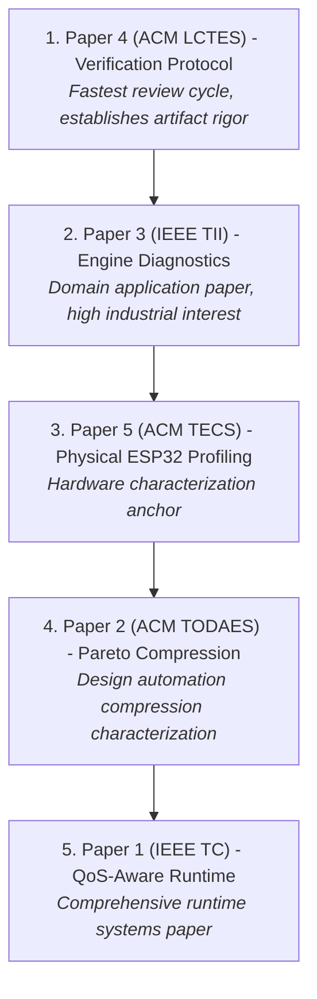

# Phase 21 — Final Venue Recommendations & Submission Sequencing Strategy

**Project:** `d:\WiDe\EngineFaultDB-main`  
**Scope:** Primary and Fallback Venue Selections and Strategic Submission Ordering  
**Date:** August 29, 2026  

---

## 1. Final Venue Recommendations by Paper

### Paper 1: QoS-Aware Multi-Fidelity Runtime
* **Primary Venue:** **IEEE Transactions on Computers (TC)**
  - *Scientific Fit:* Focuses on runtime architectures, multi-model execution, dynamic degradation scheduling, and deadline enforcement under contention.
  - *Evidence Fit:* Trace-driven simulation ($80$ configurations) grounded by empirical ESP32 model feasibility.
  - *Page/Format Fit:* 7.0 pages formatted in double-column IEEE style (well within the 12-page ceiling).
  - *Major Submission Risk:* Reviewers requesting physical FreeRTOS task preemption rather than trace-driven simulation (mitigated by clear scoping in Threats to Validity).
* **Fallback Venue:** **ACM Transactions on Embedded Computing Systems (TECS)**

---

### Paper 2: Multi-Objective Pareto Model Compression
* **Primary Venue:** **ACM Transactions on Design Automation of Electronic Systems (TODAES)**
  - *Scientific Fit:* Focuses on design space exploration, multi-objective Pareto trade-offs (Accuracy vs. Binary Size vs. Active MACs), and structured pruning versus distillation.
  - *Evidence Fit:* 12-model suite with physical on-device corroboration ($28.20\%$ speedup).
  - *Page/Format Fit:* 7.0 pages formatted in ACM/IEEE double-column format.
  - *Major Submission Risk:* Reviewers asking for new algorithmic pruning methods rather than an empirical Pareto characterization (mitigated by explicit framing as a multi-objective design space evaluation).
* **Fallback Venue:** **IEEE Transactions on Computer-Aided Design of Integrated Circuits and Systems (TCAD)**

---

### Paper 3: Cascaded Hierarchical Engine Diagnostics
* **Primary Venue:** **IEEE Transactions on Industrial Informatics (TII)**
  - *Scientific Fit:* Focuses on industrial cyber-physical condition monitoring, cost-sensitive threshold calibration ($\theta^* = 0.05$), and hierarchical engine fault diagnosis.
  - *Evidence Fit:* 55,998-record physical engine benchmark, $99.98\%$ anomaly screening recall, $89.8\%$ operational compute reduction, and $64.55\,\si{\micro\second}$ Stage-1 execution.
  - *Page/Format Fit:* 7.0 pages (well within TII's strictly enforced 10-page ceiling).
  - *Major Submission Risk:* Reviewers asking for in-vehicle road trials (mitigated by explicit bounding to edge sensor telemetry).
* **Fallback Venue:** **IEEE Sensors Journal** / **Mechanical Systems and Signal Processing (MSSP)**

---

### Paper 4: Artifact-Driven TinyML Verification Protocol
* **Primary Venue:** **ACM SIGPLAN/SIGBED Conference on Languages, Compilers, and Tools for Embedded Systems (LCTES)**
  - *Scientific Fit:* Focuses on software engineering verification methodologies, executable predicates ($\mathcal{P}_1\text{--}\mathcal{P}_7$), defect taxonomies, and artifact reproducibility for compiled TinyML binaries.
  - *Evidence Fit:* Audit resolving 20 discrepancies across 12 candidate models, $+1.80\%$ calibration bias discovery, and Tier-1 physical ESP32 case study.
  - *Page/Format Fit:* 6.0 pages (within LCTES's 10-page limit).
  - *Major Submission Risk:* Reviewers expecting formal mathematical theorem proving rather than software engineering executable test harnesses (mitigated by explicit framing as an empirical artifact verification framework).
* **Fallback Venue:** **IEEE Software** / **ACM Transactions on Software Engineering and Methodology (TOSEM)**

---

### Paper 5: On-Device Characterization and Latency Profiling
* **Primary Venue:** **ACM Transactions on Embedded Computing Systems (TECS)**
  - *Scientific Fit:* Focuses on physical on-device execution behavior, zero-I/O in-RAM timing protocols, microarchitectural translation divergence ($62.87\times\text{--}76.77\times$), FreeRTOS dual-core task partitioning, and tensor arena memory accounting.
  - *Evidence Fit:* High-density physical dataset ($N=24,000$ single-sample measurements across 4 models and 3 independent rounds) on bare-metal ESP32 silicon.
  - *Current Version:* Authoritative expanded **7-page full transaction manuscript**.
  - *Page/Format Fit:* 7.0 pages (ideal transaction length).
  - *Major Submission Risk:* Reviewers requesting evaluation across multiple silicon architectures (mitigated by detailed ISA discussion and clear silicon scoping).
* **Fallback Venue:** **IEEE Internet of Things Journal (IoT-J)** / **IEEE TCAD**  
*(Note: The earlier 4-page version remains preserved in git history as an emergency fallback for IEEE Embedded Systems Letters).*

---

## 2. Recommended Submission Sequencing Strategy

To optimize review turnaround and manage editorial tracking, we recommend the following staggered submission order:

### Rationale:
1. **Paper 4 First (LCTES):** As a conference paper with fixed review timelines, submitting Paper 4 establishes the formal verification methodology baseline.
2. **Paper 3 Second (IEEE TII):** Independent domain application paper with high industrial relevance and fast editorial turnaround.
3. **Paper 5 Third (ACM TECS):** Provides the foundational empirical silicon characterization.
4. **Paper 2 Fourth (ACM TODAES):** Rigorous model compression design exploration paper.
5. **Paper 1 Fifth (IEEE TC):** High-impact runtime systems paper that integrates the full multi-fidelity vision.

---

**FINAL RECOMMENDATION: SUBMIT ACCORDING TO STAGGERED SEQUENCE**
