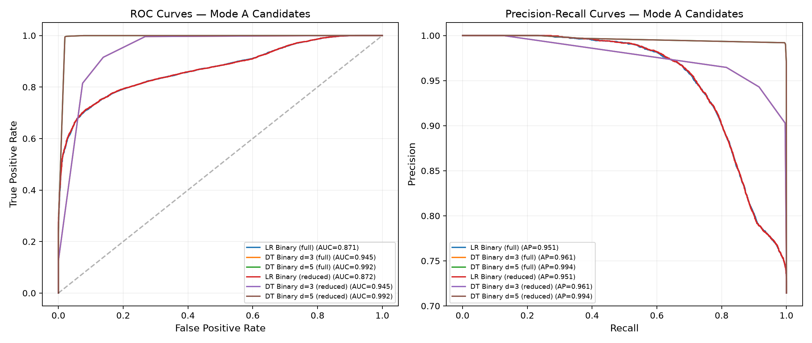

# Phase 3 — Mode A / Mode B Candidate Selection Report

**All values measured from actual model runs. No values assumed or invented.**

---

## 1. Experiment Setup

| Parameter | Value |
| --- | --- |
| Dataset | `EngineFaultDB_Final.csv` (55,998 rows after dedup) |
| Split | 40% train / 40% val / 20% test (stratified, seed=42) |
| Train | 22,399 |
| Val | 22,399 |
| Test | 11,200 |
| Scaler | Phase 2 `scaler.pkl` (frozen, NOT re-fit) |
| Latency | perf_counter_ns, 1000 warmup + 5000 iters |

## 2. Binary Target Construction

| Original Label | Binary Label |
| --- | --- |
| Fault 0 (Normal) | **0** — Normal |
| Fault 1 | **1** — Anomalous |
| Fault 2 | **1** — Anomalous |
| Fault 3 | **1** — Anomalous |

### Test Set Binary Distribution

| Class | Count | % |
| --- | --- | --- |
| Normal (0) | 3,200 | 28.6% |
| Anomalous (1) | 8,000 | 71.4% |

## 3. Mode A Candidates — Binary Screening

| Model | Features | Acc | Macro F1 | Prec | Recall | ROC-AUC | PR-AUC | Params | Size | predict lat | proba lat |
| --- | --- | --- | --- | --- | --- | --- | --- | --- | --- | --- | --- |
| LR Binary (full) | 14 | 0.7679 | 0.6793 | 0.7972 | 0.9054 | 0.8714 | 0.9508 | 15 | 975B | 90.1us | 73.3us |
| DT Binary d=3 (full) | 14 | 0.9205 | 0.8938 | 0.9030 | 0.9958 | 0.9449 | 0.9610 | 15 | 2.4KB | 68.1us | 64.1us |
| DT Binary d=5 (full) | 14 | 0.9908 | 0.9887 | 0.9912 | 0.9960 | 0.9923 | 0.9945 | 39 | 4.3KB | 67.7us | 64.7us |
| LR Binary (reduced) | 12 | 0.7655 | 0.6751 | 0.7950 | 0.9052 | 0.8717 | 0.9510 | 13 | 959B | 92.4us | 74.3us |
| DT Binary d=3 (reduced) | 12 | 0.9205 | 0.8938 | 0.9030 | 0.9958 | 0.9449 | 0.9610 | 15 | 2.4KB | 69.3us | 63.5us |
| DT Binary d=5 (reduced) | 12 | 0.9908 | 0.9887 | 0.9912 | 0.9960 | 0.9923 | 0.9945 | 39 | 4.3KB | 67.8us | 62.0us |

### Per-Class Metrics (Test Set)

#### LR Binary (full)

| Class | Precision | Recall | F1 | Support |
| --- | --- | --- | --- | --- |
| Normal | 0.6419 | 0.4241 | 0.5107 | 3200 |
| Anomalous | 0.7972 | 0.9054 | 0.8478 | 8000 |

#### DT Binary d=3 (full)

| Class | Precision | Recall | F1 | Support |
| --- | --- | --- | --- | --- |
| Normal | 0.9857 | 0.7325 | 0.8404 | 3200 |
| Anomalous | 0.9030 | 0.9958 | 0.9471 | 8000 |

#### DT Binary d=5 (full)

| Class | Precision | Recall | F1 | Support |
| --- | --- | --- | --- | --- |
| Normal | 0.9899 | 0.9778 | 0.9838 | 3200 |
| Anomalous | 0.9912 | 0.9960 | 0.9936 | 8000 |

#### LR Binary (reduced)

| Class | Precision | Recall | F1 | Support |
| --- | --- | --- | --- | --- |
| Normal | 0.6373 | 0.4163 | 0.5036 | 3200 |
| Anomalous | 0.7950 | 0.9052 | 0.8465 | 8000 |

#### DT Binary d=3 (reduced)

| Class | Precision | Recall | F1 | Support |
| --- | --- | --- | --- | --- |
| Normal | 0.9857 | 0.7325 | 0.8404 | 3200 |
| Anomalous | 0.9030 | 0.9958 | 0.9471 | 8000 |

#### DT Binary d=5 (reduced)

| Class | Precision | Recall | F1 | Support |
| --- | --- | --- | --- | --- |
| Normal | 0.9899 | 0.9778 | 0.9838 | 3200 |
| Anomalous | 0.9912 | 0.9960 | 0.9936 | 8000 |

### Confusion Matrices

**LR Binary (full):** TN=1357 FP=1843 FN=757 TP=7243

**DT Binary d=3 (full):** TN=2344 FP=856 FN=34 TP=7966

**DT Binary d=5 (full):** TN=3129 FP=71 FN=32 TP=7968

**LR Binary (reduced):** TN=1332 FP=1868 FN=758 TP=7242

**DT Binary d=3 (reduced):** TN=2344 FP=856 FN=34 TP=7966

**DT Binary d=5 (reduced):** TN=3129 FP=71 FN=32 TP=7968

### ROC and Precision-Recall Curves



## 4. Threshold Analysis (Validation Set)

### DT Binary d=5 (full)

| Threshold | Accuracy | Precision | Recall | Specificity | Macro F1 |
| --- | --- | --- | --- | --- | --- |
| 0.05 | 0.9795 | 0.9723 | 0.9998 | 0.9288 | 0.9743 |
| 0.10 | 0.9795 | 0.9723 | 0.9998 | 0.9288 | 0.9743 |
| 0.15 | 0.9795 | 0.9723 | 0.9998 | 0.9288 | 0.9743 |
| 0.20 | 0.9898 | 0.9899 | 0.9959 | 0.9747 | 0.9875 |
| 0.25 | 0.9898 | 0.9899 | 0.9959 | 0.9747 | 0.9875 |
| 0.30 | 0.9898 | 0.9899 | 0.9959 | 0.9747 | 0.9875 |
| 0.35 | 0.9898 | 0.9899 | 0.9959 | 0.9747 | 0.9875 |
| 0.40 | 0.9898 | 0.9899 | 0.9959 | 0.9747 | 0.9875 |
| 0.45 | 0.9896 | 0.9915 | 0.9940 | 0.9788 | 0.9873 |
| 0.50 | 0.9896 | 0.9915 | 0.9940 | 0.9788 | 0.9873 |
| 0.55 | 0.9896 | 0.9924 | 0.9931 | 0.9809 | 0.9873 |
| 0.60 | 0.9896 | 0.9924 | 0.9931 | 0.9809 | 0.9873 |
| 0.65 | 0.9896 | 0.9924 | 0.9931 | 0.9809 | 0.9873 |
| 0.70 | 0.9896 | 0.9924 | 0.9931 | 0.9809 | 0.9873 |
| 0.75 | 0.9896 | 0.9924 | 0.9931 | 0.9809 | 0.9873 |
| 0.80 | 0.9896 | 0.9924 | 0.9931 | 0.9809 | 0.9873 |
| 0.85 | 0.9896 | 0.9924 | 0.9931 | 0.9809 | 0.9873 |
| 0.90 | 0.9896 | 0.9924 | 0.9931 | 0.9809 | 0.9873 |
| 0.95 | 0.9896 | 0.9924 | 0.9931 | 0.9809 | 0.9873 |

### DT Binary d=5 (reduced)

| Threshold | Accuracy | Precision | Recall | Specificity | Macro F1 |
| --- | --- | --- | --- | --- | --- |
| 0.05 | 0.9795 | 0.9723 | 0.9998 | 0.9288 | 0.9743 |
| 0.10 | 0.9795 | 0.9723 | 0.9998 | 0.9288 | 0.9743 |
| 0.15 | 0.9795 | 0.9723 | 0.9998 | 0.9288 | 0.9743 |
| 0.20 | 0.9898 | 0.9899 | 0.9959 | 0.9747 | 0.9875 |
| 0.25 | 0.9898 | 0.9899 | 0.9959 | 0.9747 | 0.9875 |
| 0.30 | 0.9898 | 0.9899 | 0.9959 | 0.9747 | 0.9875 |
| 0.35 | 0.9898 | 0.9899 | 0.9959 | 0.9747 | 0.9875 |
| 0.40 | 0.9898 | 0.9899 | 0.9959 | 0.9747 | 0.9875 |
| 0.45 | 0.9896 | 0.9915 | 0.9940 | 0.9788 | 0.9873 |
| 0.50 | 0.9896 | 0.9915 | 0.9940 | 0.9788 | 0.9873 |
| 0.55 | 0.9896 | 0.9924 | 0.9931 | 0.9809 | 0.9873 |
| 0.60 | 0.9896 | 0.9924 | 0.9931 | 0.9809 | 0.9873 |
| 0.65 | 0.9896 | 0.9924 | 0.9931 | 0.9809 | 0.9873 |
| 0.70 | 0.9896 | 0.9924 | 0.9931 | 0.9809 | 0.9873 |
| 0.75 | 0.9896 | 0.9924 | 0.9931 | 0.9809 | 0.9873 |
| 0.80 | 0.9896 | 0.9924 | 0.9931 | 0.9809 | 0.9873 |
| 0.85 | 0.9896 | 0.9924 | 0.9931 | 0.9809 | 0.9873 |
| 0.90 | 0.9896 | 0.9924 | 0.9931 | 0.9809 | 0.9873 |
| 0.95 | 0.9896 | 0.9924 | 0.9931 | 0.9809 | 0.9873 |

### DT Binary d=3 (full)

| Threshold | Accuracy | Precision | Recall | Specificity | Macro F1 |
| --- | --- | --- | --- | --- | --- |
| 0.05 | 0.9221 | 0.9054 | 0.9949 | 0.7400 | 0.8962 |
| 0.10 | 0.9221 | 0.9054 | 0.9949 | 0.7400 | 0.8962 |
| 0.15 | 0.9221 | 0.9054 | 0.9949 | 0.7400 | 0.8962 |
| 0.20 | 0.9221 | 0.9054 | 0.9949 | 0.7400 | 0.8962 |
| 0.25 | 0.9221 | 0.9054 | 0.9949 | 0.7400 | 0.8962 |
| 0.30 | 0.9221 | 0.9054 | 0.9949 | 0.7400 | 0.8962 |
| 0.35 | 0.9221 | 0.9054 | 0.9949 | 0.7400 | 0.8962 |
| 0.40 | 0.9221 | 0.9054 | 0.9949 | 0.7400 | 0.8962 |
| 0.45 | 0.9221 | 0.9054 | 0.9949 | 0.7400 | 0.8962 |
| 0.50 | 0.9221 | 0.9054 | 0.9949 | 0.7400 | 0.8962 |
| 0.55 | 0.9220 | 0.9054 | 0.9947 | 0.7402 | 0.8961 |
| 0.60 | 0.9220 | 0.9054 | 0.9947 | 0.7402 | 0.8961 |
| 0.65 | 0.9023 | 0.9458 | 0.9157 | 0.8688 | 0.8831 |
| 0.70 | 0.9023 | 0.9458 | 0.9157 | 0.8688 | 0.8831 |
| 0.75 | 0.9023 | 0.9458 | 0.9157 | 0.8688 | 0.8831 |
| 0.80 | 0.8462 | 0.9675 | 0.8119 | 0.9319 | 0.8294 |
| 0.85 | 0.8462 | 0.9675 | 0.8119 | 0.9319 | 0.8294 |
| 0.90 | 0.8462 | 0.9675 | 0.8119 | 0.9319 | 0.8294 |
| 0.95 | 0.8462 | 0.9675 | 0.8119 | 0.9319 | 0.8294 |

## 5. Mode B Candidates — Multiclass Diagnosis (Existing Phase 2 Models)

| Model | Features | Acc | Macro F1 | Size | predict lat | proba lat |
| --- | --- | --- | --- | --- | --- | --- |
| MLP full (mlp.pkl) | 14 | 0.7466 | 0.7543 | 20.1KB | 129.0us | 74.3us |
| MLP reduced (mlp_reduced.pkl) | 12 | 0.7399 | 0.7406 | 21.8KB | 128.7us | 77.6us |
| DT full (decision_tree.pkl) | 14 | 0.6916 | 0.6821 | 5.5KB | 66.9us | 64.4us |
| DT reduced (decision_tree_reduced.pkl) | 12 | 0.6917 | 0.6821 | 5.5KB | 70.7us | 62.2us |
| LR full (logistic_regression.pkl) | 14 | 0.5800 | 0.5786 | 1.3KB | 83.5us | 74.5us |
| LR reduced (logistic_regression_reduced.pkl) | 12 | 0.5805 | 0.5789 | 1.3KB | 85.8us | 76.2us |

### Per-Class Detail (Top Mode B candidates)

#### MLP full

| Class | Precision | Recall | F1 | Support |
| --- | --- | --- | --- | --- |
| Fault 0 | 0.9987 | 0.9975 | 0.9981 | 3200 |
| Fault 1 | 0.9846 | 0.9900 | 0.9873 | 2200 |
| Fault 2 | 0.5308 | 0.5220 | 0.5264 | 3000 |
| Fault 3 | 0.5018 | 0.5093 | 0.5055 | 2800 |

#### MLP reduced

| Class | Precision | Recall | F1 | Support |
| --- | --- | --- | --- | --- |
| Fault 0 | 0.9981 | 0.9978 | 0.9980 | 3200 |
| Fault 1 | 0.9767 | 0.9923 | 0.9844 | 2200 |
| Fault 2 | 0.5361 | 0.3290 | 0.4078 | 3000 |
| Fault 3 | 0.4902 | 0.6871 | 0.5722 | 2800 |

## 6. Cascade Cost-Benefit Analysis

How much work does Mode A save by screening?

| Mode A Model | Predicted Normal | Flagged Anomalous | Anomaly Recall | Anomaly Precision | Missed Anomalies |
| --- | --- | --- | --- | --- | --- |
| LR Binary (full) | 2114 (18.9%) | 9086 (81.1%) | 0.9054 | 0.7972 | 757 |
| DT Binary d=3 (full) | 2378 (21.2%) | 8822 (78.8%) | 0.9958 | 0.9030 | 34 |
| DT Binary d=5 (full) | 3161 (28.2%) | 8039 (71.8%) | 0.9960 | 0.9912 | 32 |
| LR Binary (reduced) | 2090 (18.7%) | 9110 (81.3%) | 0.9052 | 0.7950 | 758 |
| DT Binary d=3 (reduced) | 2378 (21.2%) | 8822 (78.8%) | 0.9958 | 0.9030 | 34 |
| DT Binary d=5 (reduced) | 3161 (28.2%) | 8039 (71.8%) | 0.9960 | 0.9912 | 32 |

## 7. Saved Artifacts

### Mode A Models (newly trained binary classifiers)

```
  models/mode_a_lr_binary_full.pkl                         975 B
  models/mode_a_dt3_binary_full.pkl                      2,473 B
  models/mode_a_dt5_binary_full.pkl                      4,393 B
  models/mode_a_lr_binary_reduced.pkl                      959 B
  models/mode_a_dt3_binary_reduced.pkl                   2,473 B
  models/mode_a_dt5_binary_reduced.pkl                   4,393 B
```

### Mode B Models (existing Phase 2, not modified)

```
  models/mlp.pkl                                        20,592 B
  models/mlp_reduced.pkl                                22,336 B
  models/decision_tree.pkl                               5,609 B
  models/decision_tree_reduced.pkl                       5,609 B
  models/logistic_regression.pkl                         1,351 B
  models/logistic_regression_reduced.pkl                 1,287 B
```

No separate scaler is required — all Mode A models use the Phase 2 `scaler.pkl`.

---
*End of Phase 3 Mode Selection Report.*
