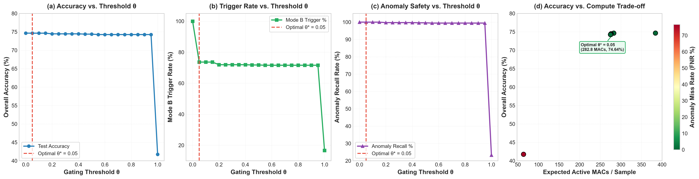

# Phase 3 — QoS Policy Sensitivity Analysis

> **Disclaimer:** The policy weights defined in this analysis are **design choices, not empirical facts**. Different applications, safety requirements, and deployment contexts will produce different optimal operating points. No single weighting is objectively superior.

---

## 1. Component Metrics and Normalization

Each measured metric is normalized to [0, 1] where **1 = best**.

| Component | Source Column | Direction | Normalization | Rationale |
| --- | --- | --- | --- | --- |
| **accuracy** | `overall_accuracy` | higher_better | `(x − 0.4176) / (0.7466 − 0.4176)` | Correct multiclass diagnosis across all fault types. Directly measures end-to-en… |
| **macro_f1** | `macro_f1` | higher_better | `(x − 0.3535) / (0.7543 − 0.3535)` | Class-balanced harmonic mean of precision and recall. Penalises poor performance… |
| **safety** | `fn_rate_anomalous` | lower_better | `(0.7672 − x) / (0.7672 − 0.0000)` | Fraction of true anomalies missed by Mode A screening. In safety-critical applic… |
| **latency_mean** | `avg_latency_us` | lower_better | `(145.4300 − x) / (145.4300 − 78.8700)` | Average per-sample host inference time. Lower is better for throughput-sensitive… |
| **latency_p95** | `p95_latency_us` | lower_better | `(205.2000 − x) / (205.2000 − 145.4000)` | 95th-percentile tail latency. Controls worst-case user experience and soft real-… |
| **latency_p99** | `p99_latency_us` | lower_better | `(298.3100 − x) / (298.3100 − 209.4000)` | 99th-percentile extreme tail. Critical for hard real-time or high-reliability de… |
| **deadline_5ms** | `deadline_5ms_compliance` | higher_better | `(x − 0.9999) / (1.0000 − 0.9999)` | Fraction of samples meeting a 5 ms host-time budget. Tightest deadline tested.… |

> **Note:** Normalization is min-max within the measured sweep range (θ ∈ [0.00, 1.00]). A component with no variation across thresholds (e.g., deadline compliance near 100%) is set to 1.0 for all points and contributes equally regardless of threshold.

## 2. Policy Profiles

Four policy profiles are defined, each representing a different engineering priority:

### Accuracy Priority

**Description:** Maximises end-to-end diagnostic accuracy and F1 above all else. Latency and deadline compliance are secondary. Suitable for offline analysis or low-throughput systems where every diagnosis must be as accurate as possible.

**Justification:** 65% of the weight is placed on accuracy + F1 because the primary goal is correct fault classification. 20% is on safety (FN rate) because missed anomalies carry risk. Only 15% is distributed across latency and deadline metrics.

| Component | Weight |
| --- | --- |
| accuracy | 0.35 |
| macro_f1 | 0.30 |
| safety | 0.20 |
| latency_mean | 0.05 |
| latency_p95 | 0.03 |
| latency_p99 | 0.02 |
| deadline_5ms | 0.05 |
| **Total** | **1.00** |

### Balanced

**Description:** A compromise between diagnostic quality, safety, and latency. No single objective dominates. Suitable for general-purpose deployments where all aspects matter moderately.

**Justification:** Accuracy (20%), F1 (15%), and Safety (20%) together hold 55% — a slight quality tilt. Latency metrics (30%) ensure the system remains responsive. Deadline compliance (15%) gives soft real-time awareness without dominating.

| Component | Weight |
| --- | --- |
| accuracy | 0.20 |
| macro_f1 | 0.15 |
| safety | 0.20 |
| latency_mean | 0.15 |
| latency_p95 | 0.10 |
| latency_p99 | 0.05 |
| deadline_5ms | 0.15 |
| **Total** | **1.00** |

### Deadline Priority

**Description:** Prioritises latency and deadline compliance for hard real-time or embedded deployments. Accuracy is still valued but not dominant. Suitable for ECU targets where timing budgets are strict.

**Justification:** 65% of the weight goes to latency + deadline metrics because meeting timing constraints is the primary objective. 20% covers accuracy + F1 as a quality floor. 15% on safety ensures anomalies are not systematically missed.

| Component | Weight |
| --- | --- |
| accuracy | 0.10 |
| macro_f1 | 0.10 |
| safety | 0.15 |
| latency_mean | 0.20 |
| latency_p95 | 0.15 |
| latency_p99 | 0.10 |
| deadline_5ms | 0.20 |
| **Total** | **1.00** |

### Safety First

**Description:** Minimises the risk of missed anomalies (false negatives). Accuracy and latency are secondary to ensuring every true fault is detected. Suitable for safety-critical industrial or automotive applications.

**Justification:** 40% weight on safety (minimising FN rate) reflects the paramount importance of never missing a fault. 25% on accuracy + F1 ensures the diagnosis is still meaningful once a fault is detected. 35% on latency ensures responsiveness in real-time control loops.

| Component | Weight |
| --- | --- |
| accuracy | 0.15 |
| macro_f1 | 0.10 |
| safety | 0.40 |
| latency_mean | 0.10 |
| latency_p95 | 0.10 |
| latency_p99 | 0.05 |
| deadline_5ms | 0.10 |
| **Total** | **1.00** |

## 3. Composite Score Results

| θ | Accuracy Priority | Balanced | Deadline Priority | Safety First | Pareto (2D) | Pareto (3D) |
| --- | --- | --- | --- | --- | --- |
| 0.00 | 0.8500 | 0.5500 | 0.3500 | 0.6500 | ✓ | ✓ |
| 0.05 | 0.8744 | 0.6241 | 0.4584 | 0.7084 | ✓ | ✓ |
| 0.10 | 0.8744 | 0.6241 | 0.4584 | 0.7084 | ✓ | ✓ |
| 0.15 | 0.8744 | 0.6241 | 0.4584 | 0.7084 | ✓ | ✓ |
| 0.20 | 0.8726 | 0.6282 | 0.4669 | 0.7113 | ✓ | ✓ |
| 0.25 | 0.8726 | 0.6282 | 0.4669 | 0.7113 | ✓ | ✓ |
| 0.30 | 0.8726 | 0.6282 | 0.4669 | 0.7113 | ✓ | ✓ |
| 0.35 | 0.8726 | 0.6282 | 0.4669 | 0.7113 | ✓ | ✓ |
| 0.40 | 0.8726 | 0.6282 | 0.4669 | 0.7113 | ✓ | ✓ |
| 0.45 | 0.8710 | 0.6276 | 0.4669 | 0.7105 | ✓ | ✓ |
| 0.50 | 0.8710 | 0.6276 | 0.4669 | 0.7105 | ✓ | ✓ |
| 0.55 | 0.8687 | 0.6269 | 0.4673 | 0.7097 | ✓ | ✓ |
| 0.60 | 0.8687 | 0.6269 | 0.4673 | 0.7097 | ✓ | ✓ |
| 0.65 | 0.8687 | 0.6269 | 0.4673 | 0.7097 | ✓ | ✓ |
| 0.70 | 0.8687 | 0.6269 | 0.4673 | 0.7097 | ✓ | ✓ |
| 0.75 | 0.8687 | 0.6269 | 0.4673 | 0.7097 | ✓ | ✓ |
| 0.80 | 0.8687 | 0.6269 | 0.4673 | 0.7097 | ✓ | ✓ |
| 0.85 | 0.8687 | 0.6269 | 0.4673 | 0.7097 | ✓ | ✓ |
| 0.90 | 0.8687 | 0.6269 | 0.4673 | 0.7097 | ✓ | ✓ |
| 0.95 | 0.8687 | 0.6269 | 0.4673 | 0.7097 | ✓ | ✓ |
| 1.00 | 0.1500 | 0.4500 | 0.6500 | 0.3500 | ✓ | ✓ |

## 4. Selected Thresholds per Policy

| Policy | Best θ | Score | Accuracy | F1 | FN Rate | Avg Latency |
| --- | --- | --- | --- | --- | --- | --- |
| **Accuracy Priority** | **0.05** | 0.8744 | 0.7464 | 0.7541 | 0.03% | 125 μs |
| **Balanced** | **0.20** | 0.6282 | 0.7446 | 0.7522 | 0.29% | 123 μs |
| **Deadline Priority** | **1.00** | 0.6500 | 0.4176 | 0.3535 | 76.72% | 79 μs |
| **Safety First** | **0.20** | 0.7113 | 0.7446 | 0.7522 | 0.29% | 123 μs |

## 5. Neighbor Comparison

For each policy, how does the selected threshold compare to its immediate neighbors?

### Accuracy Priority (θ* = 0.05)

| θ | Score | Δ Score | Accuracy | F1 | FN Rate |
| --- | --- | --- | --- | --- | --- |
| 0.00 | 0.850000 | -0.024447 | 0.7466 | 0.7543 | 0.00% |
| 0.05 **◄** | 0.874447 | +0.000000 | 0.7464 | 0.7541 | 0.03% |
| 0.10 | 0.874447 | +0.000000 | 0.7464 | 0.7541 | 0.03% |
| 0.15 | 0.874447 | +0.000000 | 0.7464 | 0.7541 | 0.03% |

### Balanced (θ* = 0.20)

| θ | Score | Δ Score | Accuracy | F1 | FN Rate |
| --- | --- | --- | --- | --- | --- |
| 0.10 | 0.624080 | -0.004082 | 0.7464 | 0.7541 | 0.03% |
| 0.15 | 0.624080 | -0.004082 | 0.7464 | 0.7541 | 0.03% |
| 0.20 **◄** | 0.628162 | +0.000000 | 0.7446 | 0.7522 | 0.29% |
| 0.25 | 0.628162 | +0.000000 | 0.7446 | 0.7522 | 0.29% |
| 0.30 | 0.628162 | +0.000000 | 0.7446 | 0.7522 | 0.29% |

### Deadline Priority (θ* = 1.00)

| θ | Score | Δ Score | Accuracy | F1 | FN Rate |
| --- | --- | --- | --- | --- | --- |
| 0.90 | 0.467288 | -0.182712 | 0.7427 | 0.7500 | 0.56% |
| 0.95 | 0.467288 | -0.182712 | 0.7427 | 0.7500 | 0.56% |
| 1.00 **◄** | 0.650000 | +0.000000 | 0.4176 | 0.3535 | 76.72% |

### Safety First (θ* = 0.20)

| θ | Score | Δ Score | Accuracy | F1 | FN Rate |
| --- | --- | --- | --- | --- | --- |
| 0.10 | 0.708426 | -0.002848 | 0.7464 | 0.7541 | 0.03% |
| 0.15 | 0.708426 | -0.002848 | 0.7464 | 0.7541 | 0.03% |
| 0.20 **◄** | 0.711274 | +0.000000 | 0.7446 | 0.7522 | 0.29% |
| 0.25 | 0.711274 | +0.000000 | 0.7446 | 0.7522 | 0.29% |
| 0.30 | 0.711274 | +0.000000 | 0.7446 | 0.7522 | 0.29% |

## 6. Pareto Frontier Analysis

### 2D Pareto (Accuracy ↑, Latency ↓)

**21 Pareto-optimal points** out of 21:

| θ | Accuracy | Avg Latency (μs) | F1 | FN Rate |
| --- | --- | --- | --- | --- |
| 0.00 | 0.7466 | 145 | 0.7543 | 0.00% |
| 0.05 | 0.7464 | 125 | 0.7541 | 0.03% |
| 0.10 | 0.7464 | 125 | 0.7541 | 0.03% |
| 0.15 | 0.7464 | 125 | 0.7541 | 0.03% |
| 0.20 | 0.7446 | 123 | 0.7522 | 0.29% |
| 0.25 | 0.7446 | 123 | 0.7522 | 0.29% |
| 0.30 | 0.7446 | 123 | 0.7522 | 0.29% |
| 0.35 | 0.7446 | 123 | 0.7522 | 0.29% |
| 0.40 | 0.7446 | 123 | 0.7522 | 0.29% |
| 0.45 | 0.7438 | 123 | 0.7513 | 0.40% |
| 0.50 | 0.7438 | 123 | 0.7513 | 0.40% |
| 0.55 | 0.7427 | 123 | 0.7500 | 0.56% |
| 0.60 | 0.7427 | 123 | 0.7500 | 0.56% |
| 0.65 | 0.7427 | 123 | 0.7500 | 0.56% |
| 0.70 | 0.7427 | 123 | 0.7500 | 0.56% |
| 0.75 | 0.7427 | 123 | 0.7500 | 0.56% |
| 0.80 | 0.7427 | 123 | 0.7500 | 0.56% |
| 0.85 | 0.7427 | 123 | 0.7500 | 0.56% |
| 0.90 | 0.7427 | 123 | 0.7500 | 0.56% |
| 0.95 | 0.7427 | 123 | 0.7500 | 0.56% |
| 1.00 | 0.4176 | 79 | 0.3535 | 76.72% |

### 3D Pareto (Accuracy ↑, Latency ↓, FN Rate ↓)

**21 Pareto-optimal points:**

| θ | Accuracy | Avg Latency (μs) | FN Rate |
| --- | --- | --- | --- |
| 0.00 | 0.7466 | 145 | 0.00% |
| 0.05 | 0.7464 | 125 | 0.03% |
| 0.10 | 0.7464 | 125 | 0.03% |
| 0.15 | 0.7464 | 125 | 0.03% |
| 0.20 | 0.7446 | 123 | 0.29% |
| 0.25 | 0.7446 | 123 | 0.29% |
| 0.30 | 0.7446 | 123 | 0.29% |
| 0.35 | 0.7446 | 123 | 0.29% |
| 0.40 | 0.7446 | 123 | 0.29% |
| 0.45 | 0.7438 | 123 | 0.40% |
| 0.50 | 0.7438 | 123 | 0.40% |
| 0.55 | 0.7427 | 123 | 0.56% |
| 0.60 | 0.7427 | 123 | 0.56% |
| 0.65 | 0.7427 | 123 | 0.56% |
| 0.70 | 0.7427 | 123 | 0.56% |
| 0.75 | 0.7427 | 123 | 0.56% |
| 0.80 | 0.7427 | 123 | 0.56% |
| 0.85 | 0.7427 | 123 | 0.56% |
| 0.90 | 0.7427 | 123 | 0.56% |
| 0.95 | 0.7427 | 123 | 0.56% |
| 1.00 | 0.4176 | 79 | 76.72% |

## 7. Does the Frontier Change Across Policies?

**Yes.** The selected threshold varies across policies: {'Accuracy Priority': np.float64(0.05), 'Balanced': np.float64(0.2), 'Deadline Priority': np.float64(1.0), 'Safety First': np.float64(0.2)}.

> **Interpretation:** The Pareto frontier is **materially degenerate** for this cascade configuration. The Mode A screener is so accurate (ROC-AUC = 0.992) that nearly all thresholds in [0.05, 0.95] produce functionally equivalent operating points. The policy analysis confirms that threshold selection is a **low-sensitivity design choice** for this particular model combination.

## 8. Visualization



## 9. Saved Artifacts

```
results/qos_policy_sensitivity.csv   — composite scores for all (policy, θ) pairs
figures/qos_policy_frontier.png       — 4-panel policy analysis figure
reports/Phase3_QoS_Policy_Analysis.md — this report
```

## 10. Reproducibility

```bash
cd d:\WiDe\EngineFaultDB-main
python scripts/qos_policy_sensitivity.py
```

---
*End of Phase 3 QoS Policy Sensitivity Analysis.*
