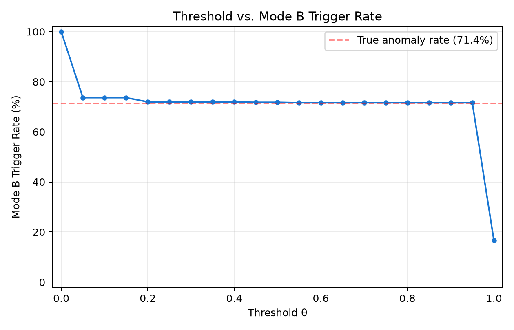
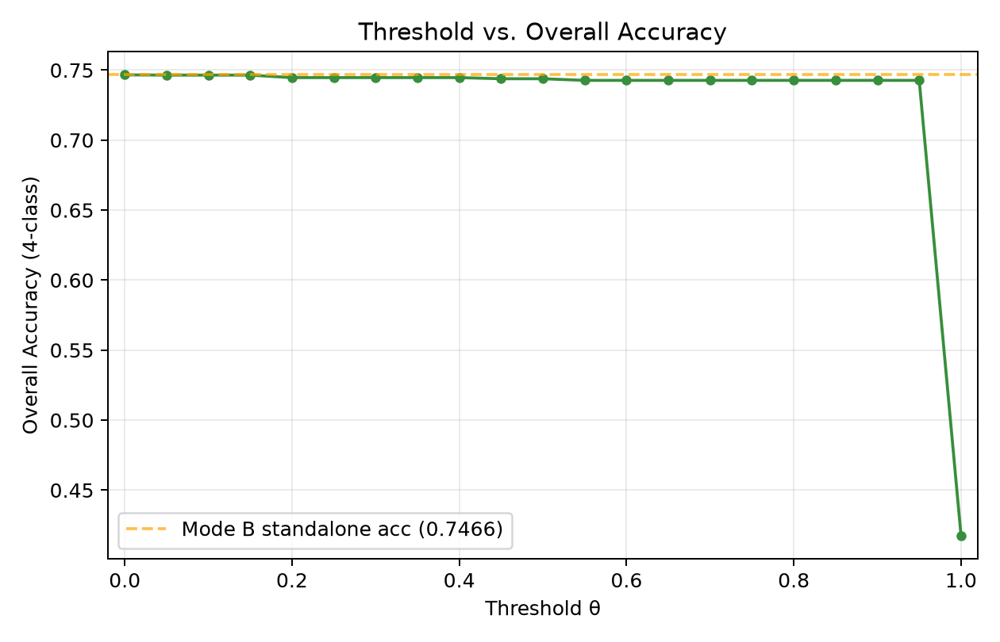
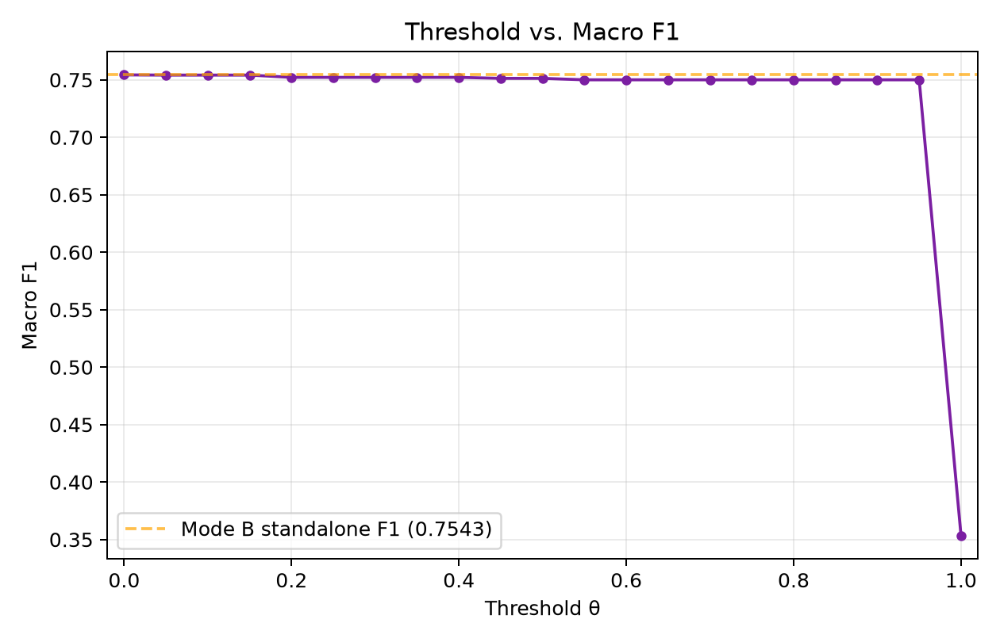
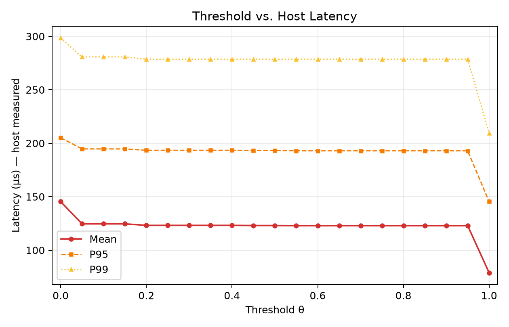
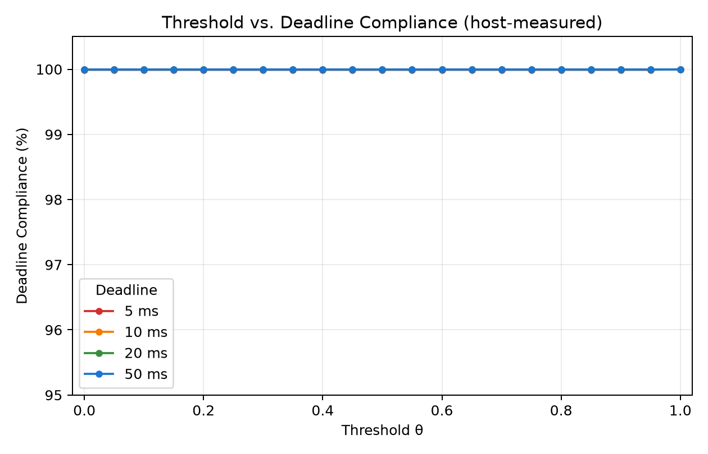
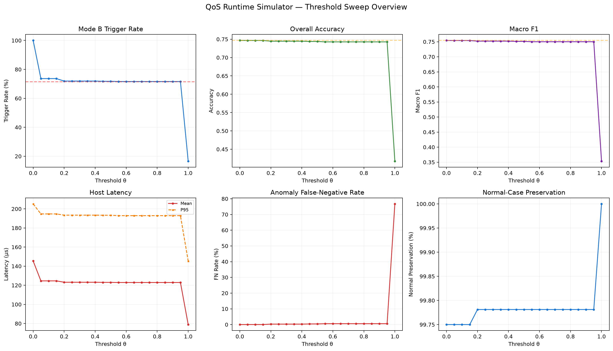

# Phase 3 — QoS Runtime Simulator v1 Report

**All latency values are measured host-machine times using `time.perf_counter_ns()`.**
**These are NOT ECU, WCET, or embedded deadline claims.**

---

## 1. Runtime Architecture

```
Input sensor vector (14 raw features)
        │
        ▼
   scaler.pkl → MinMaxScale [0,1]
        │
        ▼
   Mode A: DT Binary d=5 (12 features)
   → predict_proba() → prob_anomalous
        │
   prob_anomalous >= θ ?
        │
   ┌────┴────┐
   No        Yes
   │         │
 Normal    Mode B: MLP (16,8) (14 features)
 (Fault 0)  → predict 4-class diagnosis
              → Final Fault prediction
```

**Timing model:** `T_total = T_A + α · T_B` where α = 1 if prob ≥ θ, else 0

## 2. Experiment Setup

| Parameter | Value |
| --- | --- |
| Test set | 11,200 samples (20%, stratified, seed=42) |
| Mode A model | `mode_a_dt5_binary_reduced.pkl` (DT d=5, 12 features) |
| Mode B model | `mlp.pkl` (MLP 16-8, 14 features) |
| Scaler | `scaler.pkl` (frozen Phase 2 MinMaxScaler) |
| Warmup | 2,000 iterations per model |
| Threshold range | 0.00 to 1.00, step 0.05 |
| Deadlines tested | 5ms, 10ms, 20ms, 50ms |
| Timing method | `time.perf_counter_ns()` per sample |

## 3. Measured Host Latency (Per-Sample)

| Component | Mean | P50 | P95 | P99 | Min | Max |
| --- | --- | --- | --- | --- | --- | --- |
| Mode A (DT d=5) | 65.8 μs | 60.0 μs | 91.6 μs | 157.4 μs | 56.2 μs | 462.9 μs |
| Mode B (MLP 16-8) | 79.7 μs | 70.0 μs | 127.5 μs | 203.4 μs | 64.9 μs | 6301.0 μs |

## 4. Threshold Sweep Results

| θ | Trigger Rate | Accuracy | Macro F1 | Avg Lat (μs) | P95 Lat | P99 Lat | FN Rate | Normal Pres | 5ms | 10ms | 20ms | 50ms |
| --- | --- | --- | --- | --- | --- | --- | --- | --- | --- | --- | --- | --- |
| 0.00 | 100.0% | 0.7466 | 0.7543 | 145 | 205 | 298 | 0.00% | 99.8% | 99.99% | 100.00% | 100.00% | 100.00% |
| 0.05 | 73.6% | 0.7464 | 0.7541 | 125 | 195 | 281 | 0.03% | 99.8% | 99.99% | 100.00% | 100.00% | 100.00% |
| 0.10 | 73.6% | 0.7464 | 0.7541 | 125 | 195 | 281 | 0.03% | 99.8% | 99.99% | 100.00% | 100.00% | 100.00% |
| 0.15 | 73.6% | 0.7464 | 0.7541 | 125 | 195 | 281 | 0.03% | 99.8% | 99.99% | 100.00% | 100.00% | 100.00% |
| 0.20 | 71.9% | 0.7446 | 0.7522 | 123 | 193 | 279 | 0.29% | 99.8% | 99.99% | 100.00% | 100.00% | 100.00% |
| 0.25 | 71.9% | 0.7446 | 0.7522 | 123 | 193 | 279 | 0.29% | 99.8% | 99.99% | 100.00% | 100.00% | 100.00% |
| 0.30 | 71.9% | 0.7446 | 0.7522 | 123 | 193 | 279 | 0.29% | 99.8% | 99.99% | 100.00% | 100.00% | 100.00% |
| 0.35 | 71.9% | 0.7446 | 0.7522 | 123 | 193 | 279 | 0.29% | 99.8% | 99.99% | 100.00% | 100.00% | 100.00% |
| 0.40 | 71.9% | 0.7446 | 0.7522 | 123 | 193 | 279 | 0.29% | 99.8% | 99.99% | 100.00% | 100.00% | 100.00% |
| 0.45 | 71.8% | 0.7438 | 0.7513 | 123 | 193 | 279 | 0.40% | 99.8% | 99.99% | 100.00% | 100.00% | 100.00% |
| 0.50 | 71.8% | 0.7438 | 0.7513 | 123 | 193 | 279 | 0.40% | 99.8% | 99.99% | 100.00% | 100.00% | 100.00% |
| 0.55 | 71.6% | 0.7427 | 0.7500 | 123 | 193 | 279 | 0.56% | 99.8% | 99.99% | 100.00% | 100.00% | 100.00% |
| 0.60 | 71.6% | 0.7427 | 0.7500 | 123 | 193 | 279 | 0.56% | 99.8% | 99.99% | 100.00% | 100.00% | 100.00% |
| 0.65 | 71.6% | 0.7427 | 0.7500 | 123 | 193 | 279 | 0.56% | 99.8% | 99.99% | 100.00% | 100.00% | 100.00% |
| 0.70 | 71.6% | 0.7427 | 0.7500 | 123 | 193 | 279 | 0.56% | 99.8% | 99.99% | 100.00% | 100.00% | 100.00% |
| 0.75 | 71.6% | 0.7427 | 0.7500 | 123 | 193 | 279 | 0.56% | 99.8% | 99.99% | 100.00% | 100.00% | 100.00% |
| 0.80 | 71.6% | 0.7427 | 0.7500 | 123 | 193 | 279 | 0.56% | 99.8% | 99.99% | 100.00% | 100.00% | 100.00% |
| 0.85 | 71.6% | 0.7427 | 0.7500 | 123 | 193 | 279 | 0.56% | 99.8% | 99.99% | 100.00% | 100.00% | 100.00% |
| 0.90 | 71.6% | 0.7427 | 0.7500 | 123 | 193 | 279 | 0.56% | 99.8% | 99.99% | 100.00% | 100.00% | 100.00% |
| 0.95 | 71.6% | 0.7427 | 0.7500 | 123 | 193 | 279 | 0.56% | 99.8% | 99.99% | 100.00% | 100.00% | 100.00% |
| 1.00 | 16.6% | 0.4176 | 0.3535 | 79 | 145 | 209 | 76.72% | 100.0% | 100.00% | 100.00% | 100.00% | 100.00% |

## 5. Visualizations

### Threshold vs. Mode B Trigger Rate



### Threshold vs. Overall Accuracy



### Threshold vs. Macro F1



### Threshold vs. Host Latency



### Threshold vs. Deadline Compliance



### Combined Overview



## 6. Key Observations

### Boundary behavior

| θ | Behavior | Accuracy | F1 | Avg Lat | Trigger Rate |
| --- | --- | --- | --- | --- | --- |
| 0.00 | All → Mode B (cascade disabled) | 0.7466 | 0.7543 | 145 μs | 100% |
| 0.50 | Default threshold | 0.7438 | 0.7513 | 123 μs | 71.8% |
| 1.00 | All → Normal (Mode B never runs) | 0.4176 | 0.3535 | 79 μs | 0% |

### Threshold candidates (not ranked — trade-offs vary by application)

| Criterion | θ | Accuracy | F1 | FN Rate | Avg Lat | Trigger |
| --- | --- | --- | --- | --- | --- | --- |
| Max Accuracy | 0.00 | 0.7466 | 0.7543 | 0.00% | 145 μs | 100.0% |
| Max Macro F1 | 0.00 | 0.7466 | 0.7543 | 0.00% | 145 μs | 100.0% |
| FN ≤ 0.5%, min latency | 0.45 | 0.7438 | 0.7513 | 0.40% | 123 μs | 71.8% |

> **Note:** No single threshold is declared universally optimal. The best operating point depends on application requirements: safety criticality (minimize FN), latency budget, or diagnostic accuracy.

## 7. Saved Artifacts

```
results/
    qos_sample_trace.csv        — 11,200 rows, per-sample trace at θ=0.5
    qos_threshold_sweep.csv     — 21 rows, aggregate metrics per θ
    qos_deadline_sweep.csv      — 84 rows, per (θ, deadline) pair
    mode_selection_metrics.csv   — Mode A/B candidate comparison

figures/
    threshold_vs_trigger_rate.png
    threshold_vs_accuracy.png
    threshold_vs_macro_f1.png
    threshold_vs_latency.png
    threshold_vs_deadline_compliance.png
    qos_sweep_overview.png

scripts/
    qos_runtime_simulator.py    — this script
```

## 8. Reproducibility

```bash
cd d:\WiDe\EngineFaultDB-main
python scripts/qos_runtime_simulator.py
```

Dependencies: Python 3.13+, pandas, numpy, matplotlib, scikit-learn 1.9+, joblib

---
*End of Phase 3 QoS Runtime Simulator v1 report.*
